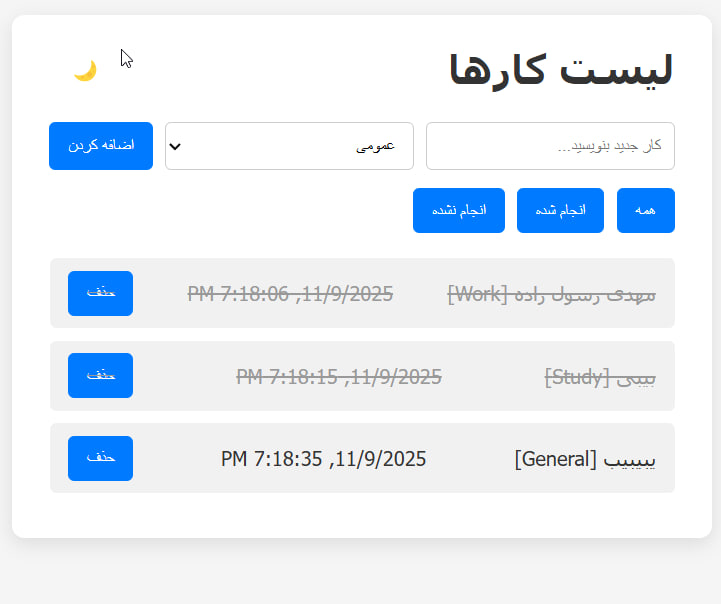

# ToDo List

A small ToDo List app I made.  
- Add tasks and delete them  
- Mark tasks as done  
- Filter tasks: All / Done / Not done  
- Shows date and time  
- Dark and Light mode  
- Saves tasks automatically in your browser

## How to use
1. Download or clone the project  
2. Open `index.html` in your browser  
3. Add your tasks and play with dark/light mode

